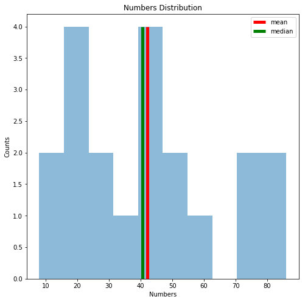
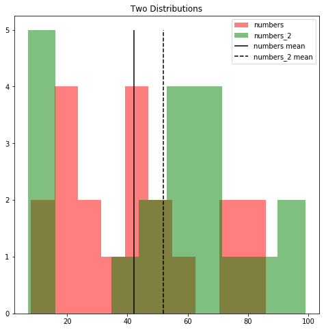
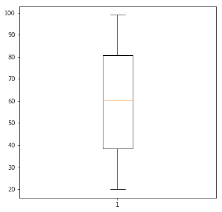

### Objectives
YWBAT
* write functions for a variety of objects
* create defaultdictionaries in functions
* calculate central tendancy statistics

Bonus
* Write lambda functions
* Apply functions within list comprehension
* use zip to create a dictionary


```python
import numpy as np
import pandas as pd

from collections import defaultdict
from random import shuffle

import matplotlib.pyplot as plt
```

### Writing Functions


```python
def find_word_length_sum(lst):
    """
    write a function that returns the sum of the lengths of all words in a list of strings
    """
    count = 0
    for word in lst:
        count += len(word)
    return count
```


```python
lst = ["this", "is", "a","list", "of", "strings"]
find_word_length_sum(lst) # 20
```


    20


```python
def group_even_odd(lst):
    """
    write a function that takes in a list of numbers
    returns a dictionary with the given structure
    keys = 'even' and 'odd'
    values = list -> list of numbers all being even or odd
    """
    d = {}
    d["evens"] = []
    d["odds"] = []
    for number in lst:
        if number % 2 == 0:
            d["evens"].append(number)
        else:
            d["odds"].append(number)
    return d
```


```python
lst = [2, 12, 10, 11, 13, 53, 14, 15]
group_even_odd(lst) # {'even': [2, 10, 12, 14], 'odd': [11, 13, 53, 15]}
```


    {'evens': [2, 12, 10, 14], 'odds': [11, 13, 53, 15]}


```python
def group_words_by_length(lst):
    """
    def group_even_odd(lst):
    write a function that takes in a list of words and
    returns a dictionary with the given structure
    keys = integers -> length of words
    values = list -> list of words with the given length
    
    hint: use defaultdict
    """
    d = defaultdict(list)
    for word in lst:
        key = len(word)
        d[key].append(word)
    return d
```


```python
lst = ["this", "is", "a","list", "of", "strings", "list"]
group_words_by_length(lst) # {4: ["this", "list"], 2:["is", "of"], 1: ["a"], 7:["strings"]}
```


    defaultdict(list,
                {1: ['a'],
                 2: ['is', 'of'],
                 4: ['this', 'list', 'list'],
                 7: ['strings']})


```python
def median_mean_greater(numbers):
    """
    write a function that returns if the median or mean of a list of numbers is greater.
    
    return "median" or "mean" depending on which is greater
    """
    median = np.median(numbers)
    mean = np.mean(numbers)
    if median > mean:
        return "median"
    return "mean"
```


```python
numbers = np.random.randint(0, 100, 20)
median_mean_greater(numbers) # varies based on numbers
```


    'mean'


```python
### Plot the histogram of the numbers from above
### make sure to add a vertical line for the mean and a vertical line for the median

#code goes here
mean = np.mean(numbers)
median = np.median(numbers)

plt.figure(figsize=(8, 8))
plt.hist(numbers, alpha=0.5) # plot this first to get the ymax value
plt.vlines(mean, ymin=0, ymax=4, colors='red', linewidth=5, label='mean')
plt.vlines(median, ymin=0, ymax=4, colors='green', linewidth=5, label='median')
plt.legend()
plt.title("Numbers Distribution")
plt.xlabel("Numbers")
plt.ylabel("Counts")
plt.show()
```





```python
numbers_2 = np.random.randint(0, 100, 20)
```


```python
### Plot both distributions (numbers_1, numbers_2) on the same histogram
### Add a legend to the plot and add a vertical line for the each mean

### code goes here

plt.figure(figsize=(8, 8))
plt.hist(numbers, color='red', label='numbers', alpha=0.5)
plt.hist(numbers_2, color='green', label='numbers_2', alpha=0.5)
plt.vlines(numbers.mean(), ymin=0, ymax=5, color='k', label='numbers mean')
plt.vlines(numbers_2.mean(), ymin=0, ymax=5, color='k', linestyle='dashed', label='numbers_2 mean')
plt.title("Two Distributions")
plt.legend()
```


    <matplotlib.legend.Legend at 0x11f9e6cf8>





```python
### create a random list of  50 numbers using np.random.randint
### numbers must be between 20 and 100
### graph the boxplot of your numbers and analyze your findings

### code goes here
numbers_3 = np.random.randint(20, 100, 50)
plt.figure(figsize=(6, 6))
plt.boxplot(numbers_3, vertical=False)
plt.show()
```





### Extra Fun Stuff


```python
tweet = "Buying a car in 2019 that can’t upgrade to full self-driving is like buying a horse instead of a car in 1919"
```


```python
tweet_words = tweet.split(" ")
```


```python
### write a lambda function that takes in a string and returns the length of the string
len_string = lambda s: len(s)
```


```python
### create a list of the length of each word in tweet
### bonus if you use 'def' method, bonus bonus if you use lambda
length_of_words_in_tweet = [len_string(word) for word in tweet_words]
length_of_words_in_tweet
```


    [6, 1, 3, 2, 4, 4, 5, 7, 2, 4, 12, 2, 4, 6, 1, 5, 7, 2, 1, 3, 2, 4]


